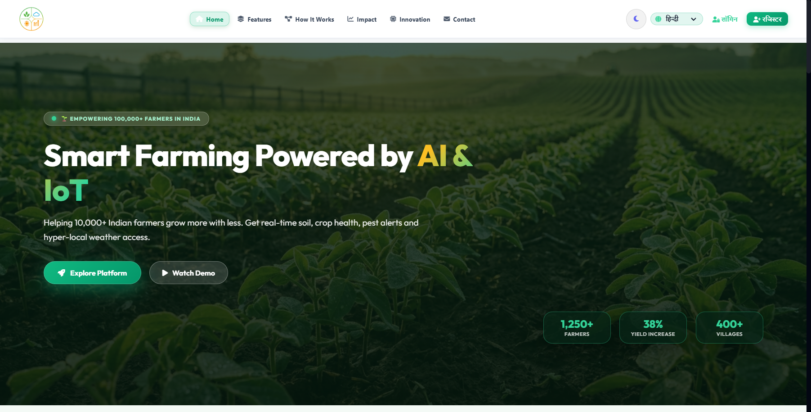

# 🌱 Krishi AI (कृषि AI) — Smart Agriculture Platform

[](https://www.python.org/)
[](https://flask.palletsprojects.com/)
[](https://ultralytics.com/)
[](https://opencv.org/)
[](https://ai.google.dev/)
[](https://leafletjs.com/)
[](https://opensource.org/licenses/MIT)

> **Empowering Indian Farmers with Edge AI, Computer Vision, Micro-Weather Radar, and Vernacular Agricultural Intelligence.**  
> *Developed for HackIndia Spark 10 (Uttarakhand North Region) by Team Quanta Byte.*

---

<p align="center">
  
</p>

---

## 🌾 The Challenge & Vision

Smallholder Indian farmers lose up to **35% of crop yields annually** due to delayed pest identification, misdiagnosed crop blights, lack of soil-specific fertilizer advisory, and unpredictable local rainfall. Existing digital farming apps suffer from:
1. Complex English-only interfaces with high digital literacy barriers.
2. Reliance on heavy cloud uploads that fail in 2G/3G rural farm belts.
3. Excessive chemical fertilizer usage (DAP/Urea) degrading soil health.

**Krishi AI solves this** through an edge-optimized, mobile-responsive web platform that combines **sub-second computer vision**, **authentic ICAR/KVK agronomic science**, **hyperlocal radar weather**, and an **interactive organic input library** accessible in **Hindi, Garhwali, and Indian regional dialects**.

---

## 🚀 Key Modules & Capabilities

```
                             ┌─────────────────────────────────┐
                             │       KRISHI AI PLATFORM        │
                             └────────────────┬────────────────┘
                                              │
         ┌───────────────────┬────────────────┼───────────────────┬───────────────────┐
         ▼                   ▼                ▼                   ▼                   ▼
┌─────────────────┐ ┌─────────────────┐ ┌───────────┐ ┌───────────────────┐ ┌─────────────────┐
│ YOLOv8 Pest AI  │ │ Disease Scan    │ │ Soil NPK  │ │ Weather & Radar   │ │ Organic Library │
│ Video & Photo   │ │ 76+ Pathologies │ │ 12 Soils  │ │ Leaflet Satellite │ │ 10 Formulations │
│ Sub-100ms Edge  │ │ Step Remedies   │ │ ICAR pH   │ │ Spray Advisories  │ │ Step Recipes    │
└─────────────────┘ └─────────────────┘ └───────────┘ └───────────────────┘ └─────────────────┘
```

### 1. 🪲 YOLOv8 AI Pest & Insect Detection (Video & Photo Mode)
* **Video Stream Detection:** Upload farm video footage (`.mp4`, `.avi`, `.webm`). The system uses `models/Pest_Detection/video_detect.py` powered by custom-trained YOLOv8 weights (`best.pt`) to annotate pests frame-by-frame.
* **Auto-Keyframe Extraction:** Extracts the peak-detection frame snapshot with bounding box overlays for instant viewing alongside the annotated video.
* **Photo Mode:** Instant sub-second bounding box identification for aphids, fruit flies, stem borers, and mites.
* **Integrated Remedies:** Provides organic deterrents (Neemastra, Brahmastra, Agniastra) and bio-pesticide dosage instructions.

### 2. 🔬 Crop Disease Health Scanner
* **Wide Disease Coverage:** Diagnoses 76+ crop pathologies across Tomato, Wheat, Rice, Potato, Sugarcane, Apple, Corn, Peach, Pepper, and Strawberry.
* **Sub-100ms Inference:** Fast optical feature diagnostic combined with TensorFlow and Gemini multimodal fallback.
* **Complete Action Plan:** Detailed disease name in Hindi/English, severity meter, cause, step-by-step treatment, and preventive hygiene.

### 3. 🧪 Optical Soil Health & NPK Recommendation
* **Instant Chromaticity Analysis:** Evaluates soil hue, saturation, and luminance to classify samples into 12 Indian pedological types (Alluvial, Black, Clay, Red, Sandy, Laterite, Loamy).
* **Scientific Diagnostics:** Estimates realistic soil pH range, moisture retention capacity, and fertility grade.
* **Crop & Fertilizer Matching:** Recommends optimal crops and precise NPK/DAP/organic manure application guidelines according to ICAR standards.

### 4. 🌦️ Micro-Weather Radar & Spraying Advisory
* **AccuWeather™ Live Sync:** Real-time temperature, humidity, wind velocity, and UV index.
* **GPS Auto-Location:** Automatically detects farmer's farm district or allows instant search across Indian cities.
* **Interactive Radar:** Leaflet.js-based precipitation, cloud cover, and wind animation overlays.
* **24-Hour Touch-Swipe Forecast:** Smooth horizontal scrolling hourly forecast strip.
* **Agricultural Spray Advisory:** Analyzes wind and rain probability to advise farmers whether spraying pesticides/fertilizers is safe.

### 5. 🍃 Interactive Organic Farming Library (10 Traditional Formulations)
* **Comprehensive Recipes:**
  1. **जीवामृत (Jeevamrutha)** — Microbial liquid bio-fertilizer
  2. **घनजीवामृत (Ghanjeevamrutha)** — Solid DAP substitute
  3. **नीमास्त्र (Neemastra)** — Sucking pest natural repellent
  4. **ब्रह्मास्त्र (Brahmastra)** — Fruit & stem borer caterpillar control
  5. **अग्निअस्त्र (Agniastra)** — Severe caterpillar & bollworm killer
  6. **पंचगव्य (Panchagavya)** — Growth promoter & plant immunity booster
  7. **दशपर्णी अर्क (Dashaparni Ark)** — 10-herbal universal pest repellent
  8. **वर्मीकम्पोस्ट (Vermicompost)** — Black gold earthworm humus
  9. **खट्टी छाछ स्प्रे (Sour Buttermilk Spray)** — Copper antifungal & antiviral
  10. **मटका खाद (Matka Khad)** — Instant micro-nutrient liquid manure
* **Interactive Modal:** Step-by-step preparation guide, exact ingredient measurements (kg/liters), dosage per acre, and one-click printable instructions.

### 6. 🎙️ Vernacular Voice Assistant & Multilingual AI Chat
* Hands-free voice interface supporting **Hindi, Garhwali/Kumaoni, Punjabi, Marathi, Gujarati, and English**.
* Farmers can speak their crop problems aloud and receive audio-visual guidance.

### 7. 📱 Mobile-First Responsive Design (300px to 4K)
* Custom CSS architecture specifically optimized for ultra-small rural smartphones (tested down to 300px width).
* Bottom navigation app bar, compact top navbar, touch-swipe strips, and zero horizontal screen wobble (`overflow-x: hidden`).
* High-contrast **Clean Black & White Light Theme** and eye-friendly **Dark Mode**.

---

## 🛠️ Technology Stack

| Layer | Technologies |
|---|---|
| **Backend & Routing** | Python 3.14, Flask, Flask-Login, Werkzeug, SQLAlchemy (SQLite/PostgreSQL) |
| **Computer Vision & AI** | PyTorch, Ultralytics YOLOv8, OpenCV, NumPy, Google Gemini API |
| **Frontend & GIS** | HTML5, CSS3 (Custom Responsive System), Vanilla JavaScript, Leaflet.js |
| **Icons & Typography** | FontAwesome 6, Google Fonts (Outfit, Inter) |
| **Deployment** | Gunicorn / Waitress, Localhost Dev Server, Render / Railway ready |

---

## 📂 Project Structure

```
KRISHI-AI/
├── app.py                             # Main Flask application & routes
├── models/
│   ├── Crop_Disease/                  # Plant disease classification weights
│   ├── Pest_Detection/
│   │   ├── best.pt                    # Trained YOLOv8 pest detection weights
│   │   └── video_detect.py            # Video stream inference pipeline
│   └── Soil_Detection/                # Soil pedological model & samples
├── backend/
│   ├── services/
│   │   ├── crop_disease_service.py    # Sub-second crop pathology engine
│   │   ├── pest_detection_service.py  # YOLOv8 video & photo service
│   │   ├── soil_analysis_service.py   # Soil optical analysis service
│   │   └── weather_service.py         # Weather & radar API integrations
│   └── utils/
│       └── image_validation.py        # Color pre-checks & image sanitation
├── templates/
│   ├── base.html                      # Layout, responsive navbar & voice buttons
│   ├── home.html                      # Landing page with KRISHI AI watermark
│   ├── dashboard.html                 # Farmer command center
│   ├── pest.html                      # Video & photo pest detection interface
│   ├── disease.html                   # Crop disease scanning interface
│   ├── soil.html                      # Soil health testing interface
│   ├── weather.html                   # Leaflet weather radar & hourly forecast
│   └── organic.html                   # 10-recipe interactive organic library
├── static/
│   ├── css/
│   │   ├── global.css                 # Theme variables & typography
│   │   ├── navbar.css                 # Responsive navbar & bottom mobile nav
│   │   └── responsive.css             # Fluid mobile queries (300px - 1200px)
│   ├── img/                           # Platform imagery & UI previews
│   │   └── krishi_ai_homepage.png     # Platform homepage preview
│   ├── js/                            # Client-side scripts
│   └── uploads/                       # User-uploaded & AI-annotated media
├── requirements.txt                   # Project dependencies
└── README.md                          # Project documentation
```

---

## ⚡ Quickstart Guide

### 1. Clone the Repository
```bash
git clone https://github.com/atul-techx/KRISHI-AI.git
cd KRISHI-AI
```

### 2. Create and Activate Virtual Environment
```bash
# Windows
python -m venv venv
venv\Scripts\activate

# Linux / macOS
python3 -m venv venv
source venv/bin/activate
```

### 3. Install Dependencies
```bash
pip install -r requirements.txt
```

### 4. Configure Environment Variables
Create a `.env` file in the root directory:
```env
SECRET_KEY=krishi_ai_super_secret_2026
GEMINI_API_KEY=your_gemini_api_key_here
ACCUWEATHER_API_KEY=your_accuweather_key_here
```

### 5. Launch the Application
```bash
python app.py
```
Open your browser and visit: **`http://127.0.0.1:5000`**

---

## 👥 Hackathon Team: Quanta Byte

* **Event:** HackIndia Spark 10 (Uttarakhand North Region)
* **Team:** Quanta Byte
* **Focus:** AgriTech · Edge Computer Vision · Vernacular AI

---

## 📄 License

This project is licensed under the [MIT License](LICENSE). Built with ❤️ for Indian Farmers.
